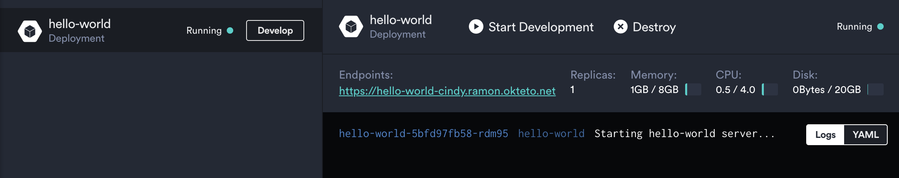
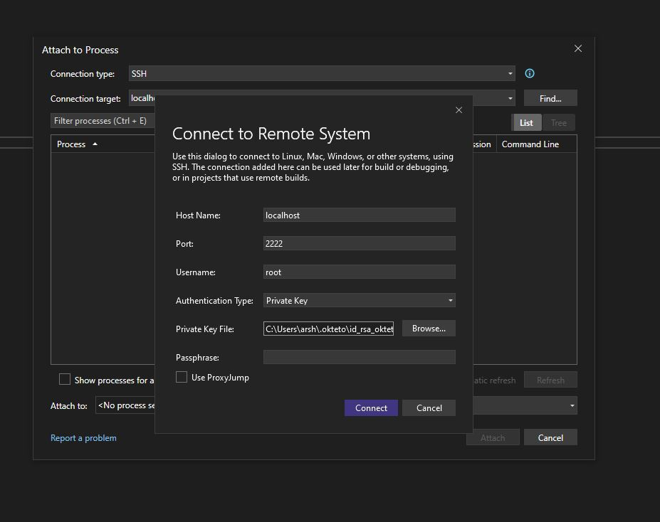
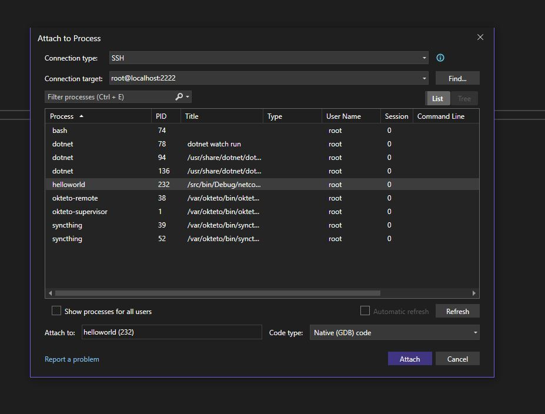

# ASP.NET Core Sample App for Visual Studio

This example shows how to leverage [Okteto](https://github.com/okteto/okteto) to develop and attach a debugger to a ASP.NET Core Sample App when using [Visual Studio](https://visualstudio.microsoft.com/).

This guide is similar to the [Getting Started on Okteto with ASP.NET Applications in Kubernetes](https://www.okteto.com/docs/samples/aspnetcore/) tutorial but has been tailored to work with Visual Studio instead of Visual Studio Code as in the original guide.

## Prerequisites

Install the latest version of the Okteto CLI and configure it to access Okteto. Follow our [installation guide](https://www.okteto.com/docs/get-started/install-okteto-cli/) if you haven't done it yet.

## Step 1: Deploy the ASP.NET Sample App

Get a local version of the ASP.NET Sample App by executing the following commands:

```bash
$ git clone https://github.com/okteto-community/aspnetcore-visualstudio-starter
$ cd aspnetcore-visualstudio-starter
```

At the root of the directory, you'll find the `okteto.yml` file. This file describes how to [deploy](https://www.okteto.com/docs/reference/okteto-manifest/#deploy-string-optional) the ASP.NET Sample App.

```yaml title="okteto.yml"
deploy:
  - kubectl apply -f k8s.yml
```

Deploy your development environment by executing:

```bash
$ okteto deploy
```

```bash
 i  Using cindy @ okteto.example.com as context
 i  Running kubectl apply -f k8s.yml
deployment.apps/hello-world created
service/hello-world created
ingress.networking.k8s.io/hello-world created
 ✓  Development environment 'aspnet-getting-started' successfully deployed
 i  Run 'okteto up' to activate your development container
```

Open your browser and go to the URL of the application. You can get the URL by logging into your Okteto instance (e.g https://okteto.example.com) and clicking on the application's endpoint:



Did you notice that you're accessing your application through an HTTPs endpoint? This is because Okteto will [automatically create them](https://www.okteto.com/docs/core/endpoints/automatic-ssl/) for you when you deploy your application. Cool no 😎?

## Step 2: Activate your development container

The [dev](https://www.okteto.com/docs/reference/okteto-manifest/#dev-object-optional) section defines how to activate a development container for the ASP.NET Sample App:

```yaml title="okteto.yml"
dev:
  hello-world:
    image: okteto/aspnetcore-getting-started:dev
    command: bash
    securityContext:
      capabilities:
        add:
          - SYS_PTRACE
    environment:
      - ASPNETCORE_ENVIRONMENT=Development
    remote: 2222
    sync:
      - hello-world:/src
```

The `hello-world` key matches the name of the hello world Deployment. The meaning of the rest of fields is:

- `image`: the image used by the development container (built from this [Dockerfile](./hello-world/Dockerfile)).
- `command`: the start command of the development container.
- `securityContext`: we need to add the `SYS_PTRACE` to our container for the debugger in Visual Studio to work.
- `environment`: the environment variables added or overwritten in your development container.
- `remote`: the local port to use for SSH communication with your development environment.
- `sync`: the folders that will be synchronized between your local machine and the development container.

Also, note that there is a `.stignore` file under the `sync` folder to indicate which files shouldn't be synchronized to your development container.
This is useful to avoid synchronizing binaries, build artifacts, or git metadata.

Next, execute the following command to activate your development container:

```bash
$ okteto up
```

```bash
 ✓  Persistent volume successfully attached
 ✓  Images successfully pulled
 ✓  Files synchronized
    Namespace: cindy
    Name:      hello-world

Welcome to your development container. Happy coding!
cindy:hello-world src>
```

Working in your development container is the same as working on your local machine.
Start the application by running the following command:

```bash
cindy:hello-world src> dotnet watch run
```

```bash
dotnet watch ⌚ Polling file watcher is enabled
dotnet watch 🔥 Hot reload enabled. For a list of supported edits, see https://aka.ms/dotnet/hot-reload.
  💡 Press "Ctrl + R" to restart.
dotnet watch 🔧 Building...
  Determining projects to restore...
  All projects are up-to-date for restore.
  helloworld -> /src/bin/Debug/netcoreapp8.0/helloworld.dll
dotnet watch 🚀 Started
warn: Microsoft.AspNetCore.Server.Kestrel[0]
      Overriding address(es) 'https://localhost:5001, http://localhost:5000'. Binding to endpoints defined via IConfiguration and/or UseKestrel() instead.
info: Microsoft.Hosting.Lifetime[14]
      Now listening on: http://0.0.0.0:5000
dotnet watch 🌐 Unable to launch the browser. Navigate to http://0.0.0.0:5000
info: Microsoft.Hosting.Lifetime[0]
      Application started. Press Ctrl+C to shut down.
info: Microsoft.Hosting.Lifetime[0]
      Hosting environment: Development
info: Microsoft.Hosting.Lifetime[0]
      Content root path: /src
```

Go back to the browser and reload the page to test that your application is running.

## Step 3: Remote Development with Okteto

Open the file `hello-world/Controllers/HelloWorldController.cs` in your favorite local IDE and modify the response message on line 25 to be _Hello world from Okteto!_. Save your changes.

```csharp
        [HttpGet]
        public string Get()
        {
             return "Hello world from Okteto!";
        }
```

Take a look at the development container shell and notice how the changes are detected by `dotnet watch run` and automatically built and reloaded.

```bash
info: Microsoft.Hosting.Lifetime[0]
      Application is shutting down...
watch : Exited
watch : File changed: /src/Controllers/HelloWorldController.cs
watch : Started
info: Microsoft.Hosting.Lifetime[0]
      Now listening on: http://0.0.0.0:5000
info: Microsoft.Hosting.Lifetime[0]
      Application started. Press Ctrl+C to shut down.
info: Microsoft.Hosting.Lifetime[0]
      Hosting environment: Development
info: Microsoft.Hosting.Lifetime[0]
            Content root path: /src
```

Go back to the browser and reload the page. Your code changes were instantly applied. No commit, build, or push required 😎!

## Step 4: Remote debugging with Okteto

Okteto enables you to debug your applications directly from your favorite IDE. Let's take a look at how that works in Visual Studio using the Visual Studio debugger.

Open `HelloWorldController.cs` in Visual Studio, set a breakpoint on line `26`. Then go to the "Debug" menu and click the "Attach to Process..." option. Once that is done a popup will open.



Here pick `SSH` as the "Connection Type" and for the "Connection Target" use the values shown above in the image. The "Private Key" can be found at your home user's directory. Depending on your os this is:

- `C:\Users\your-username\.okteto.\id_rsa_okteto` for Windows users and
- `/Users/arsh/.okteto/id_rsa_okteto` for MacOS users

Once this is done, Visual Studio will connect to your development container via SSH and give you a list of processes you can attach to. Scroll through the list and select the `helloworld` process, as shown below:



Once you select the process, Visual Studio will switch to debug view, launch the debugger, and attach it to the process you just selected. You'll know it's finished when you see the Debugger windown below.

[add image here]

Go back to the browser and reload the page. As soon as the service receives the request, the execution will halt at your breakpoint and Visual Studio will jump to the front of the screen. You can then inspect the request, the available variables, etc.

[add image here]

Your code is executing in Okteto, but you can debug it from your local machine without any extra services or tools. Pretty cool no? 😉

## Next steps

Congratulations, you just developed **your first application in Okteto** 🚀.

Okteto lets you develop your applications directly on Kubernetes. This way you can:

- Eliminate integration issues by developing in a realistic environment
- Test your application end to end as fast as you type code
- No more CPU cycles wasted in your machine. Develop at the speed of the cloud!

Find more advanced samples with Okteto in [this repository](https://github.com/okteto/samples) or [join our community](https://community.okteto.com) to ask questions and share your feedback.
